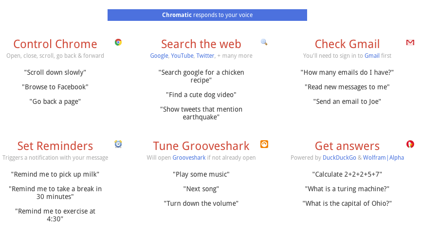
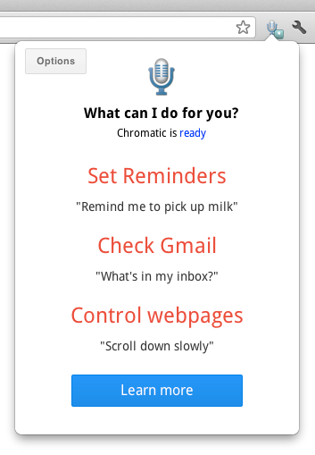
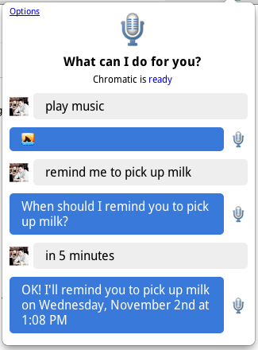
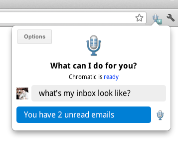
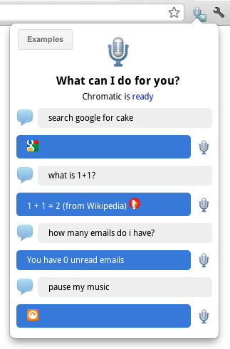

Chromatic
=

A chrome extension that uses looped `speechInput` to accept voice commands, and perform actions. It's kind of like [Siri][1] or [Google Now][2], but for the browser instead.

Since we're in a browser, there are some interesting integrations that are possible. For example:

1. Interact with webpages
  * open, reload, or close tabs
  * scroll pages
  * navigate to websites
2. Use your Google Contacts (with correct permission set) to send emails by name
3. Use the [Duck Duck Go API][3] to get instant answers to questions
4. And more... (see `/handlers` for full list)!

How would you describe it in a sentence?
-

The description according to `manifest.json` is
> Be in harmony with Chrome. Use your voice to get things done.

Sample command list
-

What does it look like in use?
-

Starting Chromatic | Using Chromatic
--- | ---
 | 

Usage examples
-

Checking email | Getting answers
--- | ---
 | 

[1]: http://www.apple.com/ios/siri/
[2]: http://www.google.com/landing/now/
[3]: https://duckduckgo.com/api
